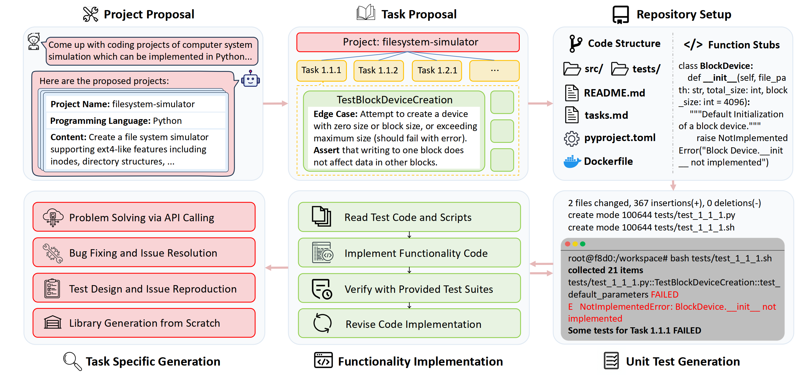
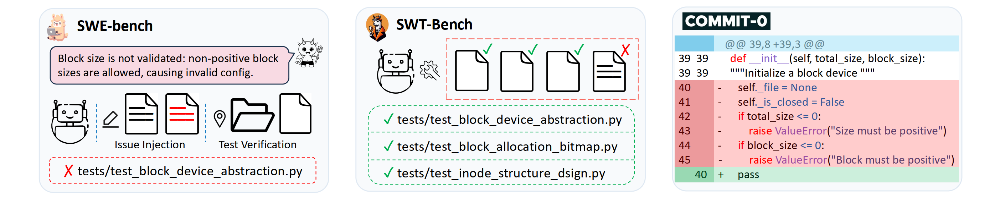
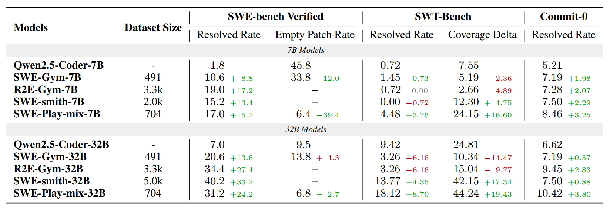
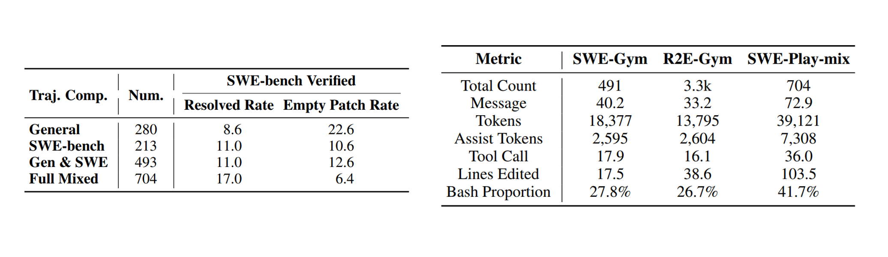

<h1 align="center"> Training Versatile Coding Agents in<br>Synthetic Environments </h1>

<p align="center">
  <a href="https://zhu-yiqi.github.io" style="text-decoration: none;">Yiqi Zhu<sup>1</sup></a>, 
  <a href="https://apga.github.io" style="text-decoration: none;">Apurva Gandhi<sup>2</sup></a>,
  <a href="https://www.phontron.com" style="text-decoration: none;">Graham Neubig<sup>2</sup></a>
</p>

<p align="center">
  <sup>1</sup>Tsinghua University, <sup>2</sup>Carnegie Mellon Univeristy<br>
</p>

<p align="center">
<a href="">📃 Paper</a>
•
<a href="https://huggingface.co/collections/StephenZhu/swe-playground" >🤗 Data & Models</a>
•
<a href="https://neulab.github.io/SWE-Playground/" >🌐 Project Page</a>
</p>

---

We present <strong>SWE-Playground</strong>, a fully automated pipeline that synthesizes tasks and verifiable unit tests from scratch for training versatile coding agents. We identify that previous environments for training SWE agents typically rely on pre-existing GitHub repositories and focus predominantly on issue resolution tasks. SWE-Playground is designed to address these limitations by proposing tasks from scratch, offering flexibility and extensibility when constructing training instances, and supporting training versatile coding agents that benefit mutually from various types of trajectories.

<div align="center">
  
</div>

---

SWE-Playground pipeline starts with an LLM proposing a project, which is then decomposed into step-by-step tasks and initialized as a repository. Subsequently, two separate agents sequentially generate unit tests and implement functionality to complete the development. Finally, to curate data tailored to specific benchmarks, we incorporate a task-specific generation stage that adapts the pipeline for diverse task types including issue resolution (SWE-bench), issue reproduction (SWT-Bench) and library generation from scratch (Commit-0).

<div align="center">
  
</div>

<div align="center">
  
</div>

---

Results demonstrate that SWE-Playground trains agents to achieve strong performance across various benchmarks using a significantly smaller dataset, and trajectories across different tasks mutually enhance performance on a single benchmark. Further analysis substantiates the high data efficiency of our approach, with our trajectories containing dense training signal and exhibiting a execution-based softward development paradigm.

<div align="center">
  
</div>

<div align="center">
  
</div>

---

## 🔧 Setup

### 1. Environment Installation

```bash
# Create and activate Conda environment
conda create -n swe-play python==3.12
conda activate swe-play

# Install package in editable mode
pip install -e .
```

### 2. OpenHands Configuration

This repository leverages OpenHands in headless mode. Please follow the [OpenHands Development setup instructions](https://docs.all-hands.dev/usage/how-to/headless-mode#with-python).


### 3. Environment Variables Setup

Configure the required environment variables to connect to your LLM provider and the OpenHands runtime:

```bash
export OPENAI_API_KEY="your_api_key"
export OPENAI_BASE_URL="your_api_endpoint"
export OPENHANDS_CONFIG_PATH="path/to/openhands/config.toml"
```

---

## 🚀 Quickstart

### Generating Projects

To launch the proposal pipeline and generate a new coding project with associated step-by-step tasks:

```bash
python -m swe_play.propose.pipeline --model claude-sonnet-4-20250514 --output generated
```

This will initialize the project repository and save the project description and task breakdown in the `generated/` directory.

For detailed documentation on the propose pipeline, please refer to [PROPOSE_README.md](swe_play/proposal/PROPOSE_README.md)

### Running Rollouts

To collect trajectories from agents working on the generated tasks:

```bash
# Ensure using absolute paths here
python -m swe_play.rollout.rollout --repo-path /path/to/your/project/repo --runtime-folder /path/to/your/runtime
```

We also support generating trajectories tailored to specific benchmarks, including issue resolution (SWE-bench), issue reproduction (SWT-Bench) and library generation from scratch (Commit-0). You can enable these by appending the corresponding flags:

```bash
python -m swe_play.rollout.rollout --repo-path /path/to/your/project/repo --runtime-folder /path/to/your/runtime --swe --swt --commit0
```

Our pipeline is designed for easy adaptation to new tasks and benchmarks. You are encouraged to implement custom adapters for specific tasks, benchmarks and use cases.

For detailed documentation on the rollout pipeline, please refer to [ROLLOUT_README.md](swe_play/rollout/ROLLOUT_README.md)

---

## 🔥 Training and Evaluation

### Training

**Dataset:**
Our collected and filtered trajectories are available on [Hugging Face](https://huggingface.co/datasets/StephenZhu/SWE-Play-trajectories).

**Training Scripts:**
Scripts for training versatile coding agents are located in the `train/` directory. These scripts are adapted from the awesome [R2E-Gym](https://github.com/R2E-Gym/R2E-Gym) offical repository.

**Prerequisites**
1. **Install LLaMA-Factory:** Follow the [official instructions](https://github.com/hiyouga/LLaMA-Factory) to install the LLaMA-Factory which is necessary for our training.
2. **Sequence Parallelism (Optional):** For sequence parallelism support, please refer to [360-LLaMA-Factory](https://github.com/Qihoo360/360-LLaMA-Factory) for setup.

**Configuration & Execution**
Before running the scripts, update the base model and dataset paths in the relevant config files under `train/` directory.

> **Note:** When using the Qwen base model, you must first modify the configuration to extend the maximum context length to 128k. Please refer to the [official Qwen documentation](https://huggingface.co/Qwen/Qwen2.5-Coder-7B-Instruct) for details.

To start training, run:

```bash
llamafactory-cli train train/train_sweplay_raw.yaml
```

### Evaluation

**Model Serving:**
We recommend serving our model using [vLLM](https://github.com/vllm-project/vllm). Please refer to the [official documentation](https://docs.vllm.ai/en/latest/getting_started/installation/) for installation and setup.

**Evaluation:**
For evaluation across various coding benchmarks, please refer to the official implementation of [VersaBench](https://github.com/juanmichelini/OpenHands/tree/versabench/evaluation/benchmarks/versabench). This repository provides easy-to-use entries and scripts for evaluating diverse benchmarks, even extending beyond the coding domain.

> **Note:** We use slightly modified prompts for these benchmarks. To reproduce our results, please substitute the original prompts with the versions provided in the `evaluation_prompts/` directory.

---

## 📚 Citation

```bibtex

```

## 📄 License

This project is licensed under the MIT License - see the [LICENSE](LICENSE) file for details.
